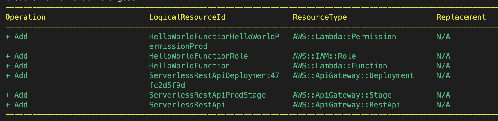

# Barebones-AWS-Lambda-with-MFA

A barebones example of how to deploy to AWS Lambda using MFA and SAM CLI, with the Least Privilege IAM policy.

#### Getting Started

Assumptions:

1. You're part of an AWS organization
2. You don't have root access, and need to request "least privilege" access to your admin in order to deploy a new Lambda function
3. Your organization requires MFA

#### Step 1: Install Dependencies

1. Install the [AWS CLI](https://docs.aws.amazon.com/cli/latest/userguide/getting-started-install.html)

```
curl "https://awscli.amazonaws.com/AWSCLIV2.pkg" -o "AWSCLIV2.pkg"
sudo installer -pkg AWSCLIV2.pkg -target /
```

and then run `aws --version` to verify that it's installed correctly.

2. Install [Docker](https://docs.docker.com/engine/install/) - This is needed for local testing of AWS SAM projects

3. Install [Homebrew](https://docs.brew.sh/) - This is needed to install the AWS SAM CLI

```
/bin/bash -c "$(curl -fsSL https://raw.githubusercontent.com/Homebrew/install/master/install.sh)"
```

Verify that it's installed correctly by running `brew --version`

4. Install the [AWS SAM CLI](https://docs.aws.amazon.com/serverless-application-model/latest/developerguide/serverless-sam-cli-install.html)

```
brew tap aws/tap
brew install aws-sam-cli
```

Verify that it's installed correctly by running `sam --version`

#### Step 2: Get the minimum roles needed for your AWS account

You'll need the following roles if you're part of an AWS organization that practices the "least-privilege" principle:

- `iam:CreateRole`
- `iam:AttachRolePolicy`
- `iam:DetachRolePolicy`
- `cloudformation:CreateChangeSet`
- `apigateway:*` SAM needs to associate your Lambda function with an API gateway

#### Step 3: Invoke the hello-world Lambda function

Run `npm run invoke` to run the included sample lambda function locally. To verify that it's working, you should get a similar output to the following:

```
{
    "statusCode": 200,
    "body": "{\"message\": \"hello world\"}"
}
```

The `SAM-Project` folder is an example node v16 + typescript lambda function originally created via a `sam init` command. You can run `sam init` and follow the guided instructions to create your own SAM environment if you desire, based on a variety of languages like Python, Rust, C#, etc.

#### Step 4: Deploy to AWS Lambda

Run `npm run deploy` to build and deploy the Lambda function to a new AWS stack called `sam-barebones-aws-lambda-with-mfa`, and with the authentication configuration called `mfa`. This command runs you through the "guided" deployment, which will ask you a few clarifying questions. Here's an example of what this could look like:

```
Looking for config file [samconfig.toml] :  Found
Reading default arguments  :  Success

Setting default arguments for 'sam deploy'
=========================================
Stack Name [sam-barebones-aws-lambda-with-mfa]:
AWS Region [us-east-1]:
#Shows you resources changes to be deployed and require a 'Y' to initiate deploy
Confirm changes before deploy [Y/n]: y
#SAM needs permission to be able to create roles to connect to the resources in your template
Allow SAM CLI IAM role creation [Y/n]: y
#Preserves the state of previously provisioned resources when an operation fails
Disable rollback [y/N]: n
HelloWorldFunction may not have authorization defined, Is this okay? [y/N]: y
Save arguments to configuration file [Y/n]: y
SAM configuration file [samconfig.toml]:
SAM configuration environment [mfa]:
```

You can take a look at the [samconfig.toml](./SAM-Project/samconfig.toml) file that we created to see where some of these values come from, and where the guided deployment may make updates.

If the deployment preparation is successful, you should see output like this:

<p float="left">

</p>

Then you'll be asked for a final confirmation to proceed, and if everything is successful, you should see output like this, depending on your region:

```
Successfully created/updated stack - sam-barebones-aws-lambda-with-mfa in us-east-1
```

#### Step 5: Try out the deployed Lambda function

Now that your Lambda function has been deployed, you should try invoking it using its Function URL.

You can generate this url by going to `AWS Console -> Lambda -> find the sam-barebones-aws-lambda-with-mfa application -> Configuration -> Function URL -> Create Function URL`.

For ease of testing purposes, set the auth type to `NONE`, making your function public. Otherwise you'll need authentication to invoke it.

<p float="left">

</p>

Then navigate to the url, and you should see this result in your browser:

```
{"message":"hello world"}
```

### Troubleshooting

There are a number of random things that can go wrong during this entire Lambda process. I've tried to include some of the most common issues, and how to resolve them.

#### Deployment Errors

If you get an error like the following during a deployment:

```

Error: Failed to create managed resources: An error occurred (ExpiredToken) when calling the CreateChangeSet operation: The security token included in the request is expired

```

You need to rerun the mfa token generation command:

1. `CODE=<YOUR_CODE> npm run mfa`
   or
2. `sh generate_mfa_tokens.sh <YOUR_CODE>`

#### Post-Deployment Errors

If you try invoking the Lambda function via the Function URL and get an error like the following:

```
{
    "message": "Internal server error"
}
```

and an accompanying error in **CloudWatch** like this:

```
Unknown application error occurred Runtime.ImportModuleError

{
    "errorType": "Runtime.ImportModuleError",
    "errorMessage": "Error: Cannot find module 'app'\nRequire stack:\n- /var/runtime/index.mjs",
    "stack": [
        "Runtime.ImportModuleError: Error: Cannot find module 'app'",
        "Require stack:",
        "- /var/runtime/index.mjs",
        "    at _loadUserApp (file:///var/runtime/index.mjs:951:17)",
        "    at async Object.UserFunction.js.module.exports.load (file:///var/runtime/index.mjs:976:21)",
        "    at async start (file:///var/runtime/index.mjs:1137:23)",
        "    at async file:///var/runtime/index.mjs:1143:1"
    ]
}
```

This is because there's an issue with the handler. There are a couple things to try depending on your setup:

1. Make sure that the handler in the [template.yaml](./SAM-Project/hello-world/../template.yaml) config is fully qualified, with its parent folder name included in the path, and that the functions are named correctly
2. If you're uploading your file via zip, you'll need to use `index` instead of `app`

#### Investigating Authentication Issues

`aws configure list` - shows you the current configuration and if your profile is set correctly or not. Example output:

```
Name        Value                       Type                        Location
----        -----                       ----                        --------

profile     <not set>                   None None
access_key  ********\*\*\*\*********    shared-credentials-file
secret_key  ********\*\*\*\*********    shared-credentials-file
region      us-east-1                   config-file                 ~/.aws/config

```

`nano ~/.aws/credentials` - You can use whatever editor you want for this. But this shows you the credentials file, separated by profiles, with the tokens/access key information. Example output:

```
[default]
aws_access_key_id = XXXXXXXXXXXXXXXXXXXX
aws_secret_access_key = XXXXXXXXXXXXXXXXXXXX
[mfa]
aws_access_key_id = XXXXXXXXXXXXXXXXXXXX
aws_secret_access_key = XXXXXXXXXXXXXXXXXXXX
aws_session_token = XXXXXXXXXXXXXXXXXXXX
```
